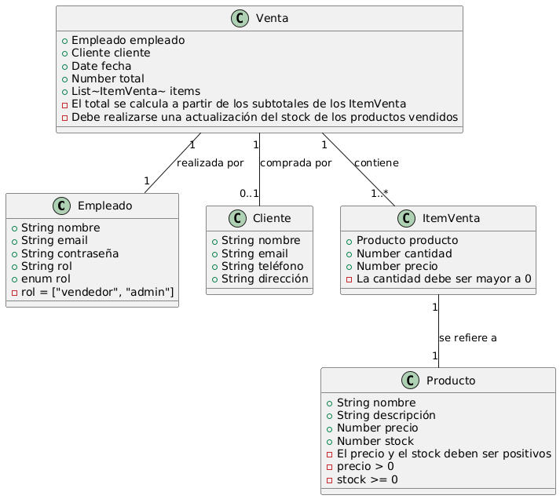

# Modelado de Datos Mongoose para Comercio de Suministros de Limpieza

## Descripción

Este proyecto implementa un modelo de datos NoSQL utilizando MongoDB y Mongoose para un comercio de suministros de limpieza. El sistema está diseñado para permitir que los empleados registren sus ventas de forma individual y accedan a la aplicación utilizando credenciales.

## Estructura del Modelo de Datos

El modelo de datos consta de las siguientes entidades principales:

1. **Empleado (Employee)**
2. **Producto (Product)**
3. **Cliente (Customer)**
4. **Venta (Sale)**

### Diagrama UML

## Decisiones de Diseño

### 1. Relaciones entre Entidades

- **Vinculación**:

  - Las ventas están vinculadas a empleados, clientes y productos mediante referencias.
  - Razón: Permite un acceso eficiente a la información de ventas por empleado, cliente o producto, y facilita las actualizaciones de datos sin afectar los registros históricos.

- **Incrustación**:
  - Los detalles de los items vendidos (producto, cantidad, precio) están incrustados en el documento de Venta.
  - Razón: Esta información es específica de cada venta y se accede frecuentemente junto con los datos de la venta.

### 2. Esquemas Flexibles

- Se utilizan campos opcionales (como `description` en productos o `phone` en clientes) para manejar datos variables.
- Razón: Aprovecha la flexibilidad de MongoDB para adaptarse a diferentes necesidades de información.

### 3. Índices

- Se crean índices en campos frecuentemente consultados como `email` en Empleado y `date` en Venta.
- Razón: Mejora el rendimiento de las consultas comunes.

### 4. Validación de Datos

- Se implementa validación básica usando `required: true` para campos obligatorios.
- Se utiliza `unique: true` para campos que deben ser únicos, como el email de empleados y clientes.
- Se utiliza `enum` para campos con valores predefinidos, como el rol de los empleados.
- Razón: Asegura la integridad de los datos a nivel de esquema.

## Implementación

El modelo se implementa utilizando Mongoose, con los siguientes esquemas principales:

1. `employeeSchema`: Define la estructura de los empleados, incluyendo autenticación.
2. `productSchema`: Define la estructura de los productos de limpieza.
3. `customerSchema`: Define la estructura de los clientes.
4. `saleSchema`: Define la estructura de las ventas, incluyendo referencias a empleados, clientes y productos.

Cada esquema incluye campos relevantes y validaciones apropiadas para garantizar la integridad de los datos.
